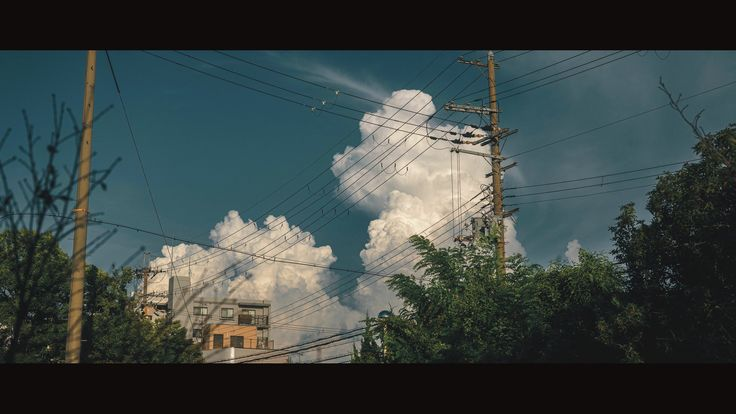

 

<h2 align="center">  <em>About  me </em></h2>

 

  hey <em><b> i'm evan thomas </b></em>, a gap year student hoping to do a foundation year in computer science after a gap year (2027-2028). i enjoy learning, and am currently creating small projects to prepare for foundation year with html, css, python and eventually java in the future, thanks for looking.

 

